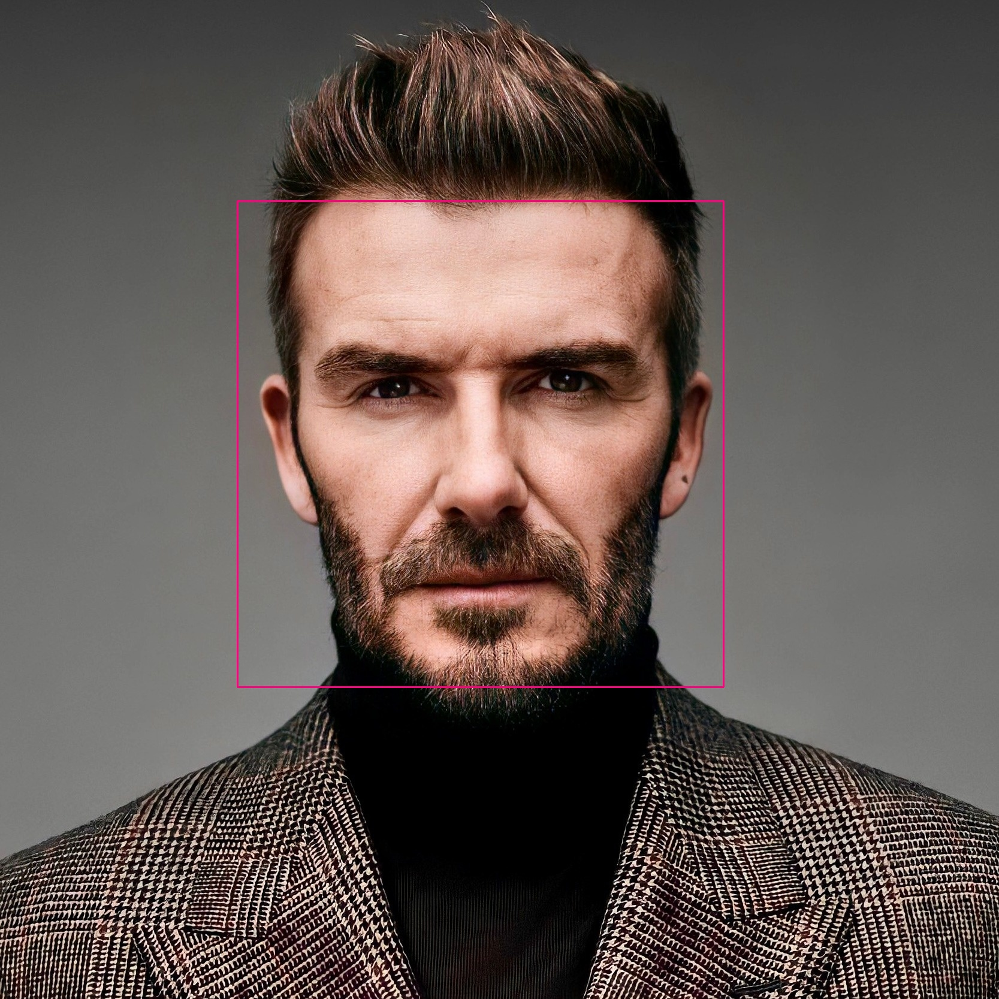

# Face Detection

A simple script that can detect face in an image using Haar Cascade algorithm.

Haar cascade is an algorithm that can detect objects in images, irrespective of their scale in image and location. Haar cascade uses the cascading window, and it tries to compute features in every window and classify whether it could be an object. Sample haar features traverse in window-sized across the picture to compute and match features. 

Haar cascade works as a classifier. It classifies positive data points that are part of our detected object and negative data points that don’t contain our object.

- Haar cascades are fast and can work well in real-time.

- Haar cascade is not as accurate as modern object detection techniques are.

- Haar cascade has a downside. It predicts many false positives.

- Simple to implement, less computing power required.

## Sample

Here is an example of the face detection.

